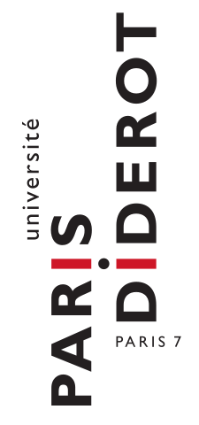
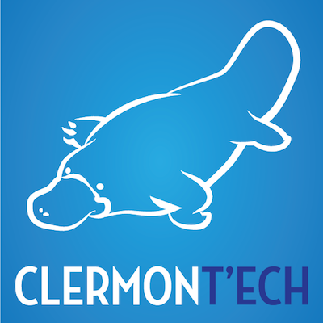

<!-- 
Title: Let's open science & research data. Now.
Date: 06/26/2015
Event: E1S3
URL: http://www.e1-conference.com/programme.html#talk_13
Author: Julien Maupetit
-->

    <h3>Let's Open Science &amp;</h3>
    <h2>Research Data</h2>
    <h4>Now</h4>

    <h6 class="author">Julien Maupetit</h6>
    <a href="https://twitter.com/julienmaupetit" target="_blank">@julienmaupetit</a>
    

----
<!-- ---------- Section ---------- -->

### Disclaimer

> I am not trying to be exhaustive & this is not evangelism.

----
<!-- ---------- Section ---------- -->

### Outline

1. `$ whoami`
2. (Academic) research
2. About Open Science
3. Main barriers to openness
4. Tools & initiatives
5. Conclusion

----
<!-- ---------- Section ---------- -->

## `$ whoami`

---

---

---

---

---

----
<!-- ---------- Section ---------- -->

## (academic) research

---

<small>Source: [PhD Comics](http://www.phdcomics.com/comics/archive.php?comicid=1431)</small>

---

<small>Source: [PhD Comics](http://www.phdcomics.com/comics/archive.php?comicid=1443)</small>

---

### Research quality assessment

---

#### Researcher's h-index (Hirsch index)

>  A scientist has index `h` if `h` of his/her Np papers have at least `h` citations each, and the other (Np − `h`) papers have no more than `h` citations each.

<small>Source: [Wikipedia](https://en.wikipedia.org/wiki/H-index)</small>

<!-- A researcher with a h-index of 35 has 35 of its publications cited at least 35 times -->

---

#### Journal impact factor

> In any given year, the impact factor of a journal is the average number of citations received per paper published in that journal during the two preceding years.

<small>Source: [Wikipedia](https://en.wikipedia.org/wiki/Impact_factor)</small>

----
<!-- ---------- Section ---------- -->

## Open Science

---

### A definition

> Open science is the movement to make scientific research, data and dissemination accessible to all levels of an inquiring society, amateur or professional.

<small>Source: [Wikipedia](https://en.wikipedia.org/wiki/Open_science)</small>

---

### Another definition

> Open Science describes the on-going transitions in the way research is performed, researchers collaborate, knowledge is shared, and science is organised. [...] facilitating more transparency, openness, networking, collaboration, and refocuses science from a 'publish or perish' perspective to a knowledge-sharing perspective.

<small>Source: [European Commission Blog](https://ec.europa.eu/commission/2014-2019/moedas/blog/opening-era-innovation_en)</small>

---

<small>Source: [Wikimedia commons](https://commons.wikimedia.org/wiki/File:Open_Science_-_Prinzipien.png)</small>

---

### Reproducibility

> Data not available. Study cannot be reproduced.

<small>Source: [Ingo Rohlfing's blog](https://ingorohlfing.wordpress.com/2015/06/18/two-proposals-for-incentivizing-data-archiving/)</small>

---

### Publishing is not enough

> On estime que les publications permettent d’accéder à environ 10 % de celles-ci, le reste restant disponible mais non utilisé sur les disques durs d’ordinateurs. Dans certaines disciplines, des résultats valables et importants restent non publiés et beaucoup de données sont sous-utilisées ou perdues (c’est en particulier le cas des données issues de résultats négatifs qui sont oubliées).

<small>Source: Les enjeux éthiques du partage des données scientifiques • Avis du COMETS (7 mai 2015)</small>

---

### Gateway to innovation

---

### Citizen scientists

----
<!-- ---------- Section ---------- -->

## Main barriers to openness

---

### EU, governments & national institutions, all agree about scientific open data, but...

---

### 1. A lack of information

Many (most?) scientists are not aware of Science 2.0

---

### 2. A reputation economy

> [...] academic system [...] is not driven by monetary incentives, nor the desire for scientific progress, but by individual reputation-expressed in (high ranked journal) publications.

<small>Source: [arXiv:1503.00481](http://arxiv.org/abs/1503.00481)</small>

> The career system has to gratify open science.

<small>Source: EuroScientist • Open Science Special Issue • June 2015</small>

---

### 3. Editors

> Une fois accumulées, ces données, si elles ne sont pas dans des bases publiques [...] mais restent exclusivement entre les mains des éditeurs, risquent de constituer pour les éditeurs un «marché de données» fermé et autonome par rapport aux publications, alors qu’elles n’étaient demandées que pour contrôler les résultats.

<small>Source: Les enjeux éthiques du partage des données scientifiques • Avis du COMETS (7 mai 2015)</small>

----
<!-- ---------- Section ---------- -->

## Tools & initiatives

---

* Better metrics for science impact
* Aggregates many sources (blog, twitter, etc.)

---

* Research data repository
* **Citable**
* Open Source

---

* Research data repository
* **Citable**
* Privacy control

---

> The Global Alliance of Genomics and Health is dedicated to enabling secure sharing of genomic and clinical data.

* 285 institutions (30 countries)
* I can haz API with Schemas

---

* EU + US + Australia
* Not restricted to a particular domain

---

### Open Science Framework

----
<!-- ---------- Section ---------- -->

## Conclusions

---

### Open Science in 2015

* Open Source ~10 years ago
* "Sharing data is not enough"
* Develop new tools to make research data valuable
* Spread the word

----

### Say hello

[julien@tailordev.fr](mailto:julien@tailordev.fr?subject=Hello)

